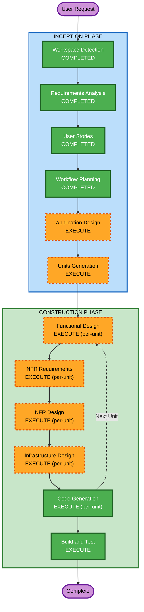

# Execution Plan

## Detailed Analysis Summary

### Change Impact Assessment
- **User-facing changes**: Yes — Patient triage chat, patient portal, real-time status
- **Structural changes**: Yes — Multi-agent system with supervisor orchestration, event-driven escalation
- **Data model changes**: Yes — Patient records, triage sessions, consent, SOAP notes, audit trails
- **API changes**: Yes — REST APIs for portal, WebSocket for chat, webhooks for escalation
- **NFR impact**: Yes — HIPAA compliance, encryption, log redaction, 99.9% availability

### Risk Assessment
- **Risk Level**: High — Regulated healthcare, PHI handling, real-time escalation
- **Rollback Complexity**: Moderate — Serverless architecture enables per-component rollback
- **Testing Complexity**: Complex — Clinical scenarios, multi-agent orchestration, compliance testing

## Workflow Visualization



### Text Alternative
```
Phase 1: INCEPTION
  - Workspace Detection (COMPLETED)
  - Requirements Analysis (COMPLETED)
  - User Stories (COMPLETED)
  - Workflow Planning (COMPLETED)
  - Application Design (EXECUTE)
  - Units Generation (EXECUTE)

Phase 2: CONSTRUCTION (per-unit loop)
  - Functional Design (EXECUTE per-unit)
  - NFR Requirements (EXECUTE per-unit)
  - NFR Design (EXECUTE per-unit)
  - Infrastructure Design (EXECUTE per-unit)
  - Code Generation (EXECUTE per-unit)
  - Build and Test (EXECUTE — after all units)
```

## Phases to Execute

### INCEPTION PHASE
- [x] Workspace Detection (COMPLETED) — Greenfield detected
- [x] Requirements Analysis (COMPLETED) — Comprehensive depth, 10 FRs + 5 NFRs
- [x] User Stories (COMPLETED) — 20 stories, 5 personas, 8 epics
- [x] Workflow Planning (IN PROGRESS) — This document
- [ ] Application Design — **EXECUTE**
  - **Rationale**: New multi-agent system requires component identification, service layer design, inter-agent communication patterns, and AWS service mapping. The 6-agent architecture + supervisor + portal needs explicit design before coding.
- [ ] Units Generation — **EXECUTE**
  - **Rationale**: System decomposes into 7+ units (6 agents + portal + shared infra). Units have dependencies (Supervisor orchestrates all others, Clinical Summary depends on Symptom Assessment output). Explicit unit breakdown with dependency graph needed.

### CONSTRUCTION PHASE (per-unit)
- [ ] Functional Design — **EXECUTE**
  - **Rationale**: Each agent has complex business logic (urgency scoring algorithm, drug interaction rules, routing patterns, SOAP template generation). Detailed data models and business rules needed before code.
- [ ] NFR Requirements — **EXECUTE**
  - **Rationale**: HIPAA compliance, encryption, PHI redaction, 99.9% availability, <3 minute triage time — each unit has specific NFR implications.
- [ ] NFR Design — **EXECUTE**
  - **Rationale**: NFR patterns (encryption-at-rest config, log redaction middleware, auto-scaling policies) need to be designed into each unit's architecture.
- [ ] Infrastructure Design — **EXECUTE**
  - **Rationale**: AWS CDK infrastructure (Bedrock, DynamoDB, Lambda/ECS, API Gateway, SNS, KMS, CloudWatch) needs explicit service mapping per unit.
- [ ] Code Generation — **EXECUTE** (ALWAYS)
  - **Rationale**: Implementation of all units
- [ ] Build and Test — **EXECUTE** (ALWAYS)
  - **Rationale**: Build instructions, unit tests, integration tests, clinical scenario tests

### OPERATIONS PHASE
- [ ] Operations — **PLACEHOLDER** (future)

## No Stages Skipped

Given the complexity (regulated healthcare, multi-agent AI system, HIPAA, real-time escalation), all conditional stages add value. This is the full treatment — appropriate for a complex, high-risk MVP.

## Estimated Units (to be finalized in Units Generation)

| Unit | Description | Key Dependencies |
|---|---|---|
| 1. Shared Infrastructure | CDK stack, VPC, KMS, DynamoDB tables, common config | None (built first) |
| 2. Symptom Assessment Agent | Conversational AI, Bedrock integration, structured intake | Shared Infra |
| 3. Triage Scoring Agent | Urgency classification algorithm, confidence scoring | Symptom Assessment output |
| 4. Drug Interaction Agent | Pharmacy system interface, interaction checking | Shared Infra, patient medication data |
| 5. Specialist Routing Agent | Department mapping, availability checking, scheduling | Shared Infra, Triage Scoring output |
| 6. Clinical Summary Agent | SOAP note generation, EHR push (stubbed) | All agent outputs |
| 7. Supervisor Agent | Orchestration, emergency escalation, human handoff | All agents |
| 8. Patient Portal | Web/mobile UI, auth, real-time status, appointments | All backend services |

## Estimated Timeline
- **Remaining Inception** (Application Design + Units Gen): ~1 session
- **Construction** (8 units × design + code): ~4-6 sessions
- **Build and Test**: ~1 session
- **Total**: ~6-8 sessions (aligns with 6-8 week MVP timeline)

## Success Criteria
- **Primary Goal**: Working patient triage system handling conversational AI assessment with specialist routing
- **Key Deliverables**: 6 functional agents + supervisor + patient portal, all deployed to AWS
- **Quality Gates**: HIPAA compliance verified, <3 min triage time, consistent urgency scoring, PHI encryption confirmed
